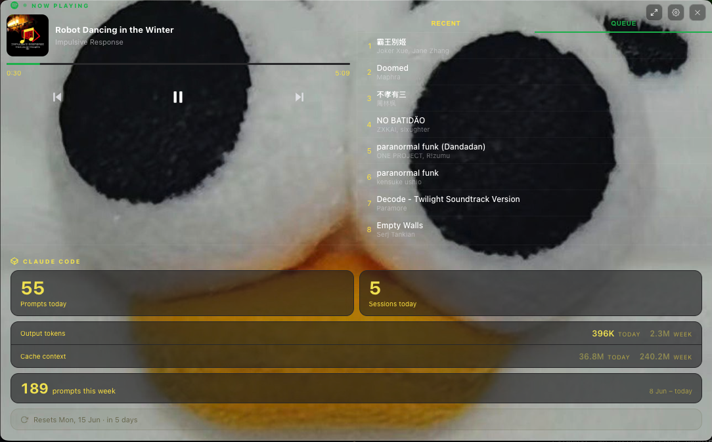

# OddyFloatDeck

A floating macOS desktop widget that sits on top of all your windows — no dock icon, no clutter. Shows your Spotify playback and Claude Code usage stats at a glance. Named after Oddy, the soft toy in the default background.



## Features

- **Spotify** — now playing, playback controls, recently played, live queue
- **Claude Code** — prompts today/this week, output tokens, cache tokens, next reset countdown
- **Rate limit banner** — countdown timer when you hit Claude's rate limit
- **Customisable** — background image, accent colours, overlay opacity
- **Always on top** — floats over all other windows, no dock icon

## Requirements

- macOS
- Node.js (install via [Homebrew](https://brew.sh): `brew install node`)
- Spotify account — optional, for Spotify features
- [Claude Code](https://claude.ai/code) — optional, for Claude stats

## Installation

```bash
git clone https://github.com/mjkknmj78f-hue/oddy-float-deck.git
cd oddy-float-deck
npm install
./start.sh
```

## Spotify setup

The queue tab and playback controls require a free Spotify developer app:

1. Go to [developer.spotify.com/dashboard](https://developer.spotify.com/dashboard) and create an app
2. In the app settings add `http://127.0.0.1:8888/callback` as a Redirect URI and save
3. Copy the **Client ID**
4. In the widget, open **Settings** (⚙ icon) → **Spotify Queue** → paste your Client ID → click **Connect**
5. Authenticate in the browser — done. Tokens are stored locally and auto-refreshed.

## Claude Code stats

No setup needed. If Claude Code is installed, usage is read automatically from `~/.claude/`. If you only use Claude via the web, the Claude section will show dashes — Spotify still works fine.

## Create a launcher icon

To launch from a clickable icon rather than the terminal:

```bash
# Build the icon from your background image
ICONSET=/tmp/OddyFloatDeck.iconset && mkdir -p $ICONSET
sips -s format png user-bg.jpg --out /tmp/user-bg-src.png > /dev/null
for res in 16x16 32x32 64x64 128x128 256x256 512x512 1024x1024; do
  w=${res%x*}; sips -z $w $w /tmp/user-bg-src.png --out "$ICONSET/icon_${res}.png" > /dev/null
done
cp $ICONSET/icon_32x32.png   $ICONSET/icon_16x16@2x.png
cp $ICONSET/icon_64x64.png   $ICONSET/icon_32x32@2x.png
cp $ICONSET/icon_256x256.png $ICONSET/icon_128x128@2x.png
cp $ICONSET/icon_512x512.png $ICONSET/icon_256x256@2x.png
cp $ICONSET/icon_1024x1024.png $ICONSET/icon_512x512@2x.png
iconutil -c icns $ICONSET -o /tmp/OddyFloatDeck.icns

# Build the .app
ELECTRON=$(pwd)/node_modules/electron/dist/Electron.app/Contents/MacOS/Electron
APPDIR=$(pwd)
python3 -c "
e='$ELECTRON'; a='$APPDIR'
s='do shell script \"nohup ' + e + ' ' + a + ' > /tmp/dash.log 2>&1 &\"\n'
open('/tmp/oddy.applescript','w').write(s)"
osacompile -o /Applications/OddyFloatDeck.app /tmp/oddy.applescript
cp /tmp/OddyFloatDeck.icns /Applications/OddyFloatDeck.app/Contents/Resources/droplet.icns
xattr -cr /Applications/OddyFloatDeck.app
echo "Done — OddyFloatDeck.app is in /Applications"
```

## Settings

Click the ⚙ icon (top right) to customise:
- Background image (swap out Oddy for your own)
- Background overlay colour and opacity
- Card, text, and accent colours
- Spotify connection

## License

MIT
